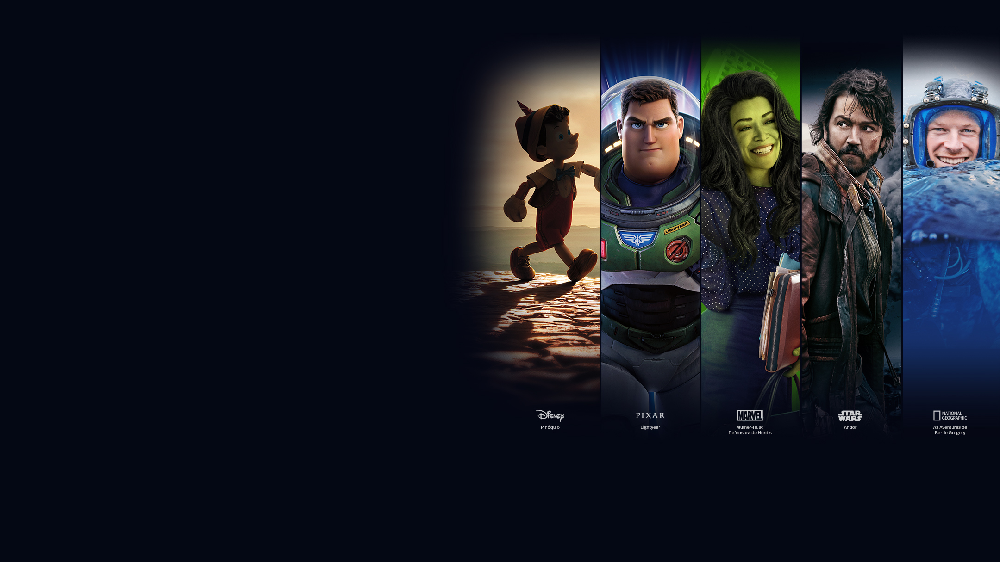

# Clone Disney+

Um clone da página inicial do Disney+, desenvolvido com HTML, SCSS e JavaScript puro. Projeto responsivo, moderno e automatizado com Gulp.



## 🚀 Funcionalidades

- **Layout Responsivo**: Adapta-se a qualquer dispositivo.
- **Tabs de Conteúdo**: Seção de atrações com navegação por abas.
- **Accordion FAQ**: Perguntas frequentes com efeito de abrir/fechar.
- **Header Dinâmico**: Efeito ao rolar a página.
- **SCSS Modularizado**: Organização dos estilos por componentes.
- **Build Automatizado**: Compilação de SCSS e minificação de JS com Gulp.

## 📁 Estrutura

```
├── index.html
├── gulpfile.js
├── package.json
├── assets/
│   └── fonts/
├── src/
│   ├── images/
│   ├── scripts/
│   │   └── main.js
│   └── styles/
│       ├── main.scss
│       ├── _header.scss
│       ├── _footer.scss
│       ├── _hero.scss
│       ├── _shows.scss
│       ├── _plans.scss
│       ├── _available-devices.scss
│       └── _faq.scss
└── ...
```

## 🛠️ Como rodar o projeto

1. **Instale as dependências:**
   ```sh
   npm install
   ```

2. **Desenvolvimento (com watch):**
   ```sh
   npm run dev
   ```

3. **Build para produção:**
   ```sh
   npm run build
   ```

4. **Abra o arquivo** `index.html` **no navegador.**

---

## 📦 Tecnologias Utilizadas

- HTML5
- SCSS ([`src/styles/main.scss`](src/styles/main.scss))
- JavaScript ([`src/scripts/main.js`](src/scripts/main.js))
- Gulp ([`gulpfile.js`](gulpfile.js))

---

## 📄 Licença

Projeto com fins educacionais. Todos os direitos das marcas, imagens e logos pertencem à Disney.

---

Feito com 💙 por Julio Cezar